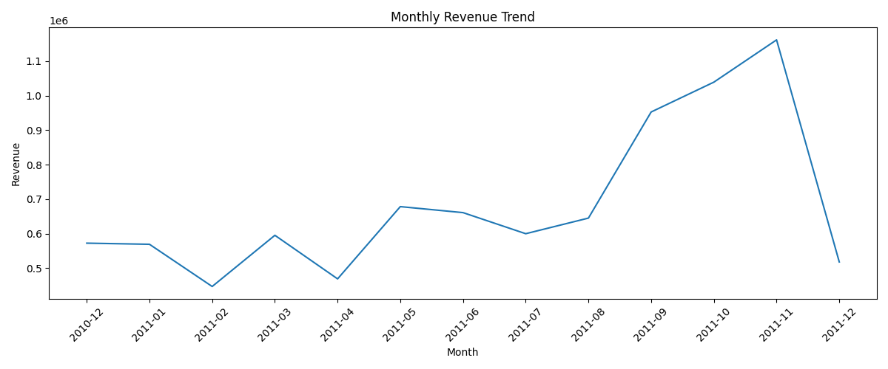
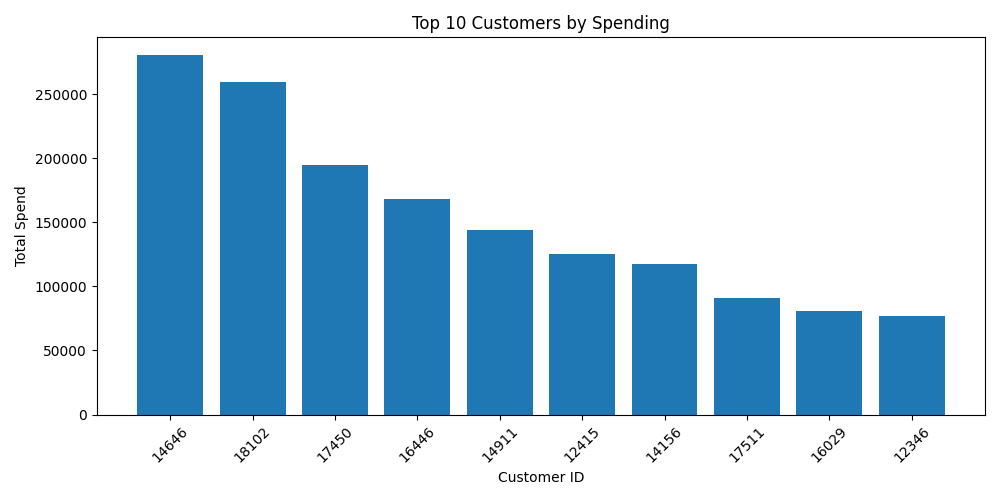
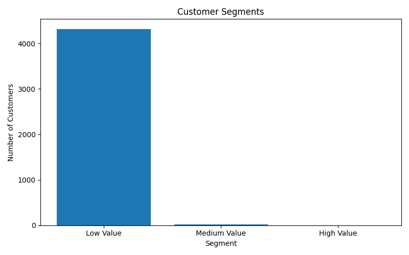
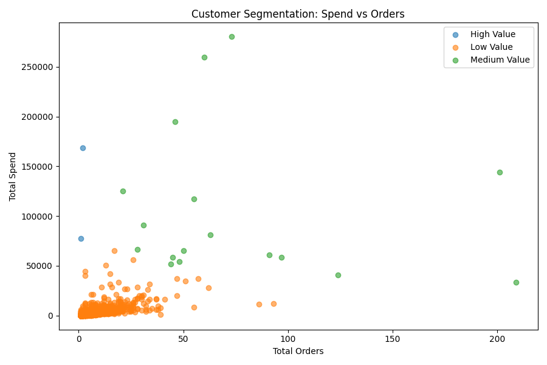

# Customer Analytics & Segmentation Dashboard

This project analyzes real-world retail transaction data to identify revenue trends, customer behavior, and customer segments using Python, SQL, machine learning, and Streamlit.

## Project Overview

The project answers key business questions:

- Who are the highest-value customers?
- How does revenue trend over time?
- What customer segments exist based on spending behavior?
- Which customers are low, medium, or high value?

## Tools Used

- Python
- pandas
- SQLite / SQL
- scikit-learn
- Matplotlib
- Streamlit

## Project Features

- Cleaned real retail transaction data
- Created revenue and customer-level features
- Used SQL queries to analyze customer spending and monthly revenue
- Applied K-Means clustering to segment customers
- Built an interactive dashboard to visualize KPIs, trends, and customer segments

## How to Run

Install dependencies: 
bash
pip install pandas numpy matplotlib scikit-learn openpyxl streamlit

CLean the Data: 
python src/clean_data.py

Run SQL analysis and charts:
python src/analysis.py

Run customer segmentation:
python src/segmentation.py

Launch dashboard:
python -m streamlit run src/dashboard.py

##  Model Visualizations

###  Monthly Revenue Trend

---

###  Top Customers by Spending

---

### Customer Segments Distribution

---

###  Customer Spend vs Orders

